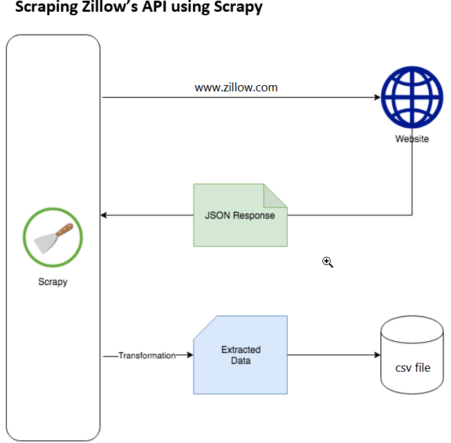
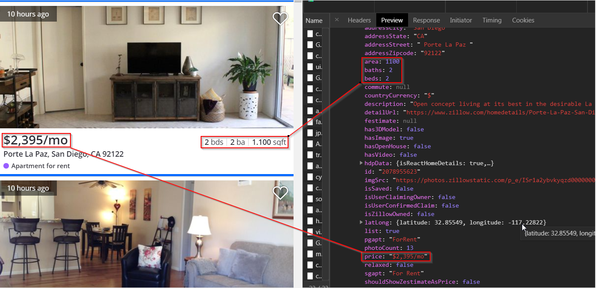
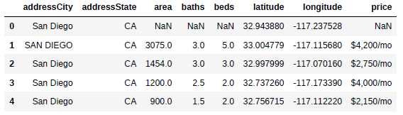
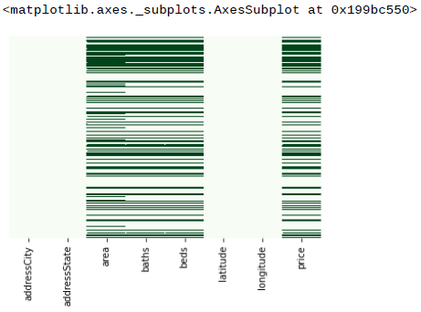
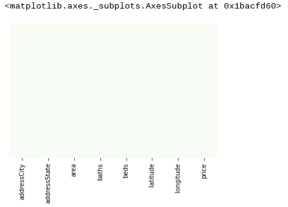
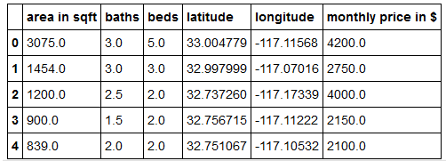

# HousePricesInSanDiego

+ [Table of Contents](#sub-sub-heading-1)
    + [Credits](#credits)
    + [Project Goal and procedure](#project-goal-and-procedure)
    + [Code and Resources](#code-and-resources)
    + [Part 1- Scraping Data using Scrapy](#part-1--scraping-data-using-scrapy)
    + [Part 2- Data Cleaning and Feature Engineering](#part-2--data-cleaning-and-feature-engineering)
    + [Part 3- Exploratory Data Analysis](#part-3--exploratory-data-analysis)
    + [Part 4- Model Building](#part-4--model-building)
    + [Part 5- Flask Server](#part-5--flask-server)
    + [Part 6- Project Limitation](#part-6--project-limitation)
    

    
 ### Credits: 
 A big thank you goes to [KenJee](https://www.youtube.com/channel/UCiT9RITQ9PW6BhXK0y2jaeg), [Codebasics](https://www.youtube.com/channel/UCh9nVJoWXmFb7sLApWGcLPQ), [Krish Naik](https://www.youtube.com/user/krishnaik06), [Keith Galli](https://www.youtube.com/channel/UCq6XkhO5SZ66N04IcPbqNcw)  and to the whole [Edureka Team](https://www.youtube.com/user/edurekaIN) who put a lot of effort to teach people Data Science,Machine Learning, Statistics and a lot of other related topics for free.
 
 ### Project Goal and Procedure
 * Goal: Build a Model which can predict monthly prices for renting apartments in San Diego, CA. 
 * Scraped apartment and price information from Zillow.com using Python and Scrapy. 
 * Saved results in a csv file and manipulated and worked with the data using the pandas package
 * visualization of data using seaborn and matplotlib packages
 * Built a linear regression model with an accuracy of 75%
 * Turned the model into an API using Flask
 

### Code and Resources

* Python Version: 3.7
* Environment: Visual Studio, Pycharm, Jupyter Notebook
* Packages: Scrapy, Matplotlib, Seaborn, Numpy, Scikit-learn, Flask

### Part 1- Scraping Data using Scrapy
Data was extracted by scraping the website's API and storing the results in a csv file. Scrapy is a common framework for extracting, processing, and storing web data. Zillow is a US- real estate market place. 

 

#### Data Scraped:
* City
* State
* Area in Sqft
* Baths
* Beds
* Latitude
* Longitude
* Price 

### Output in pandas after scraping (first 5 entries)
 

## Part 2- Data Cleaning and Feature Engineering
After scraping the data and storing it in csv and pandas, I had to do some cleaning steps like:
* remove rows where data is missing
* make the data machine readable (e.g. changing the data types, removing string elements from specific columns)
* rename some columns
* remove 'city' and'state' columns because every just San Diego data is analyzed so we dont get any additional value from that information 

Example of using the matplotlib visualization package to get an overview what data is missing:

When data is missing you can either take the median or the mean of the available data for the missing values or remove the row completely. I decided to remove every row which where data is missing. In total, more than 40% of the data rows were deleted (Before removing: 840 entries, After removing: 485 entries). After the rows were deleted, the same visualization technique shows that we do not have missing values in our dataset anymore:

After modifiying the data, the rows and the columns, our data frame looks like this (first 5 entries):

